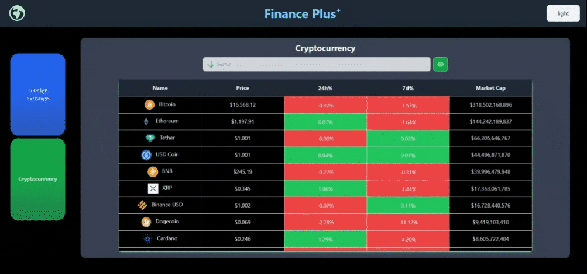

# Finance App

The aim of the project is to easily see foreign exchange and cryptocurrency. This project was made with React. Styled with "TailwindCSS" and responsive design for mobile phones and web. Data for foreign exchange and cryptocurrency are taken from two different APIs.

For look [please click here](https://finance-app-react.netlify.app/)



## Project Skeleton

```
Finance App
|
├── public
│     └── index.html
├── src
│    ├── components
│    │       ├── Navbar.jsx
│    │       └── Aside.jsx
│    ├── pages
│    │       ├── Cryptocurrency.jsx
│    │       └── ForeignExchange.jsx
│    ├── config
│    │       └── api.js
│    ├── router
│    │       └── AppRouter.jsx
│    ├── App.js
│    ├── App.css
│    ├── index.js
│    └── index.css
|----README.md
├── finance-app.gif
├── .gitignore
├── package.json
├── postcss.config.js
├── tailwind.config.js
└── yarn.lock
```

# Getting Started with Create React App

This project was bootstrapped with [Create React App](https://github.com/facebook/create-react-app).

### `yarn create react-app finance-app_react`

## Available Scripts

In the project directory, you can run:

### `yarn start`

Runs the app in the development mode.\
Open [http://localhost:3000](http://localhost:3000) to view it in your browser.

The page will reload when you make changes.\
You may also see any lint errors in the console.
